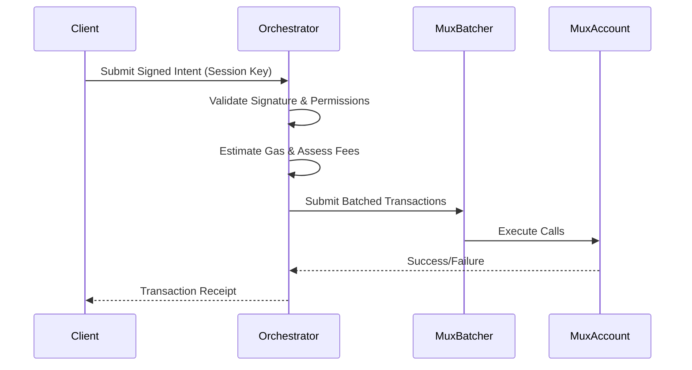

# Account Abstraction: Backend Orchestrator Integration

This document defines the scope and implementation requirements for linking the Mux Protocol Account Abstraction (AA) layer to an off-chain backend orchestrator.

## Scope and Objectives

The backend orchestrator acts as a relayer and execution manager for AA transactions. Its primary goals are to:
1. Receive user intents and map them to smart contract calls.
2. Abstract fee payments by covering network fees (gas) and optionally charging users in other tokens or off-chain mechanisms.
3. Batch multiple actions via the `mux-batcher` to reduce latency and costs.
4. Verify user session keys and signatures before submission.

## Architecture

## Integration Points

### 1. Intent Submission API
The orchestrator must expose an endpoint for receiving payloads:
- **Endpoint**: `POST /v1/transactions/intent`
- **Payload**:
  - `account_id`: The Mux smart account address.
  - `calls`: Array of contract calls (target, function, arguments).
  - `signature`: The user's ECDSA/Ed25519 signature over the payload.
  - `nonce`: For replay protection.

### 2. Relayer Execution
The orchestrator signs the Soroban transaction with its own funding key. The `mux-account` will be configured to allow the orchestrator's address to execute transactions on behalf of the user, provided the user's intent signature is valid.

### 3. Graceful Degradation
- **Invalid State**: If an account is locked or the session key is expired, the orchestrator should return a `400 Bad Request` with an appropriate error code (see `error_codes.md`).
- **Stale Nonces**: Handle nonce mismatches by fetching the latest on-chain nonce and optionally asking the client to retry.
- **Disconnected/Network Errors**: Implement exponential backoff for submitting transactions to the Soroban RPC.

## Acceptance Criteria
- Orchestrator API definitions are documented.
- The `mux-batcher` and `mux-account` have tests simulating a relayer submission.
- Replay protection is explicitly covered.
- No regressions in direct execution flows (where users fund their own transactions).
