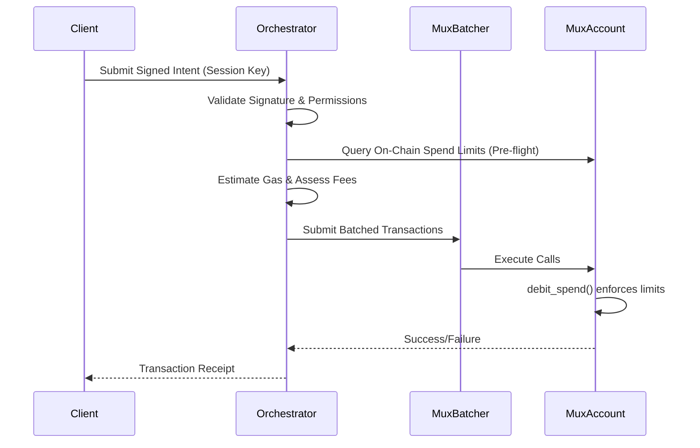

# Account Abstraction: Backend Orchestrator Integration

**Version:** 1.1.0  
**Date:** 2026-08-26  
**Status:** Audit Ready  
**Issue:** #686  
**Related:** [Custodial vs Contract AA](custodial-vs-contract-aa.md), [Access Control Checklist](access-control-checklist.md)

---

This document defines the scope and implementation requirements for linking the Mux Protocol Account Abstraction (AA) layer to an off-chain backend orchestrator.

## Scope and Objectives

The backend orchestrator acts as a relayer and execution manager for AA transactions. Its primary goals are to:
1. Receive user intents and map them to smart contract calls.
2. Abstract fee payments by covering network fees (gas) and optionally charging users in other tokens or off-chain mechanisms.
3. Batch multiple actions via the `mux-batcher` to reduce latency and costs.
4. Verify user session keys and signatures before submission.
5. **Coordinate with on-chain spend limits** to prevent double-spend attacks (#686).

## Architecture

```mermaid
sequenceDiagram
    participant Client
    participant Orchestrator
    participant MuxBatcher
    participant MuxAccount

    Client->>Orchestrator: Submit Signed Intent (Session Key)
    Orchestrator->>Orchestrator: Validate Signature & Permissions
    Orchestrator->>MuxAccount: Query On-Chain Spend Limits (Pre-flight)
    Orchestrator->>Orchestrator: Estimate Gas & Assess Fees
    Orchestrator->>MuxBatcher: Submit Batched Transactions
    MuxBatcher->>MuxAccount: Execute Calls
    MuxAccount->>MuxAccount: debit_spend() enforces limits
    MuxAccount-->>Orchestrator: Success/Failure
    Orchestrator-->>Client: Transaction Receipt
```

## Integration Points

### 1. Intent Submission API
The orchestrator must expose an endpoint for receiving payloads:
- **Endpoint**: `POST /v1/transactions/intent`
- **Payload**:
  - `account_id`: The Mux smart account address.
  - `calls`: Array of contract calls (target, function, arguments).
  - `signature`: The user's ECDSA/Ed25519 signature over the payload.
  - `nonce`: For replay protection.

### 2. Relayer Execution
The orchestrator signs the Soroban transaction with its own funding key. The `mux-account` will be configured to allow the orchestrator's address to execute transactions on behalf of the user, provided the user's intent signature is valid.

### 3. Spend Limit Coordination (#686)

**Critical requirement:** The backend orchestrator must query on-chain spend limits **before** submitting transactions to prevent double-spend attacks.

#### Pre-flight Limit Check

Before accepting a user intent, the orchestrator must:

1. **Query current spend:** Call `mux-account.get_spend_limit(asset)` to fetch `SpendLimit { amount, spent, period_start, period_ledgers }`.
2. **Calculate remaining:** `remaining = amount - spent`.
3. **Validate intent:** If the intent requests spending `new_amount` and `new_amount > remaining`, reject with `HTTP 400` and error code `SPEND_LIMIT_EXCEEDED`.
4. **Handle period rollover:** If `current_ledger >= period_start + period_ledgers`, the period has rolled over and `spent` will be reset to 0 on the next `debit_spend` call. The orchestrator should account for this in its remaining calculation.

#### Batch Spending

When batching multiple operations via `mux-batcher`:

1. **Cumulative check:** Sum the spending amounts across all operations in the batch.
2. **Reject if total exceeds remaining:** If `sum(op.amount for op in batch) > remaining`, reject the entire batch pre-flight.
3. **Atomic enforcement:** Even if the orchestrator's pre-flight check passes, the on-chain `debit_spend` call in `mux-account` is the authoritative enforcement point. If limits change between pre-flight and execution (e.g., another transaction consumes the remaining limit), the batch will fail on-chain with `ExceedsLimit`.

#### Error Handling

When a transaction fails on-chain due to `ExceedsLimit`:

- **Propagate exact error:** Return the on-chain error code to the client, not a generic "transaction failed" message.
- **Include remaining limit:** Optionally include the current `remaining` value in the error response so the client can retry with a smaller amount.
- **Do not retry automatically:** The orchestrator must not automatically retry a failed transaction with the same parameters, as this could lead to nonce exhaustion or repeated failures.

#### Invisible Wallets and Limit Tracking

If the orchestrator manages "invisible wallets" (custodial session keys):

- **No independent enforcement:** The orchestrator must NOT maintain a separate off-chain spend limit counter that rejects transactions before querying on-chain limits. Off-chain tracking is acceptable for analytics and UI purposes only.
- **Canonical source of truth:** `mux-account.SpendLimit` storage is the **only** authoritative limit. The orchestrator must always defer to it.
- **Backend relayer is not exempt:** The fact that the orchestrator's relayer key covers gas does not grant it the ability to bypass spend limits. All spending paths must flow through `mux-account.debit_spend()`.

See [custodial-vs-contract-aa.md § Mux-Backend vs On-Chain Split](custodial-vs-contract-aa.md#mux-backend-vs-on-chain-split-686) for detailed double-spend prevention rules.

### 4. Graceful Degradation
- **Invalid State**: If an account is locked or the session key is expired, the orchestrator should return a `400 Bad Request` with an appropriate error code (see `error_codes.md`).
- **Stale Nonces**: Handle nonce mismatches by fetching the latest on-chain nonce and optionally asking the client to retry.
- **Disconnected/Network Errors**: Implement exponential backoff for submitting transactions to the Soroban RPC.
- **Spend Limit Exceeded**: Return `400 Bad Request` with error code `SPEND_LIMIT_EXCEEDED` when pre-flight check fails.

## Acceptance Criteria
- Orchestrator API definitions are documented.
- The `mux-batcher` and `mux-account` have tests simulating a relayer submission.
- Replay protection is explicitly covered.
- No regressions in direct execution flows (where users fund their own transactions).
- **Pre-flight spend limit checks are implemented and tested (#686).**
- **Backend orchestrator cannot bypass on-chain spend limits (#686).**

## API Error Codes

| Code | HTTP Status | Description |
|------|-------------|-------------|
| `INVALID_SIGNATURE` | 401 | User's intent signature is invalid or expired |
| `SPEND_LIMIT_EXCEEDED` | 400 | Requested spending exceeds on-chain limit |
| `SESSION_KEY_EXPIRED` | 403 | Session key is past its expiry timestamp |
| `NONCE_MISMATCH` | 409 | Submitted nonce does not match on-chain nonce |
| `BATCH_TOO_LARGE` | 400 | Batch contains more than `MAX_BATCH_SIZE` (50) operations |
| `ACCOUNT_LOCKED` | 403 | Account is locked (recovery in progress, or paused) |

## Monitoring and Observability

Deploy metrics for:

- **Spend limit rejections:** Count of pre-flight rejections due to `SPEND_LIMIT_EXCEEDED`.
- **Limit exhaustion rate:** Fraction of users hitting limits within a time window.
- **Backend vs on-chain drift:** Periodically reconcile off-chain analytics tracking with on-chain `SpendLimit` storage.
- **Nonce gaps:** Failed transactions due to nonce mismatches.
- **Gas coverage:** Track gas costs covered by the relayer and charge users accordingly.
