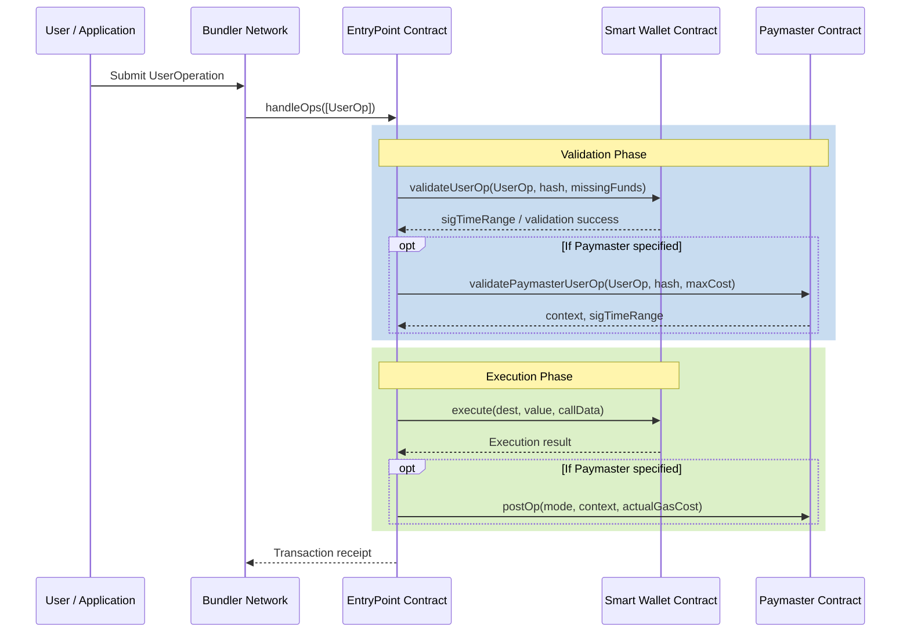

# Account Abstraction (AA) Sequence Diagram

This sequence diagram illustrates the typical lifecycle of an ERC-4337 transaction within the Mux Protocol.

## Overview
1. **Submission**: The user submits a signed `UserOperation` to the bundler network.
2. **Validation**: The EntryPoint contract first asks the Smart Wallet to validate the signature and the nonce. If a Paymaster is involved, it is also queried to ensure it is willing to sponsor the transaction.
3. **Execution**: The EntryPoint executes the specific calldata on the Smart Wallet. Post-operation logic runs on the Paymaster if applicable.
