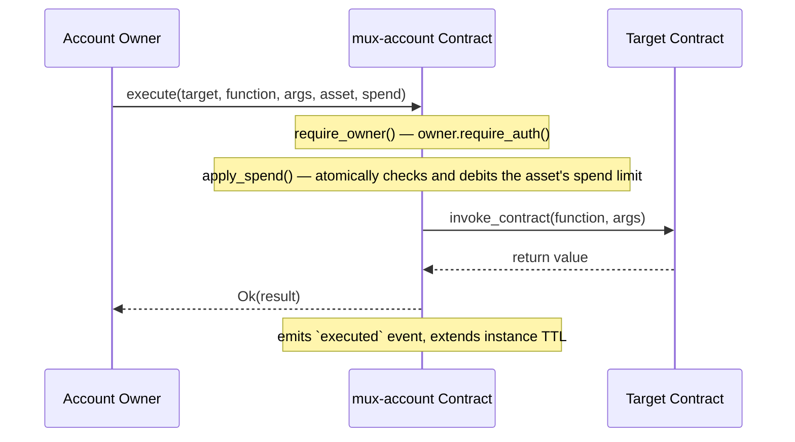

# Account Abstraction (AA) Sequence Diagrams

`mux-account` implements two distinct execution paths. There is no
`EntryPoint`, `Bundler`, `Paymaster`, or `UserOperation` concept anywhere in
this codebase — those are ERC-4337 (Ethereum) terms and do not apply here.
This document was previously written as a generic ERC-4337 diagram; it now
reflects what the Soroban contract actually implements.

## Owner-authorized execution (`execute`) — fully implemented

This is the only path that currently dispatches a payload to a target
contract. The owner signs directly; the spend limit is enforced atomically
around the cross-contract call.

```mermaid
sequenceDiagram
    participant Owner as Account Owner
    participant Account as mux-account Contract
    participant Target as Target Contract

    Owner->>Account: execute(target, function, args, asset, spend)
    Note over Account: require_owner() — owner.require_auth()
    Note over Account: apply_spend() — atomically checks and debits the asset's spend limit
    Account->>Target: invoke_contract(function, args)
    Target-->>Account: return value
    Account-->>Owner: Ok(result)
    Note over Account: emits `executed` event, extends instance TTL
```

## Session-key execution (`execute_with_session`) — implemented

This is the account-abstraction-style path: an owner pre-authorizes a
session key out of band, and a third party (a relayer, a dApp backend) later
acts using that session key without the owner signing each call. The call is
dispatched to the target contract under the account's authorization context.

```mermaid
sequenceDiagram
    participant Owner as Account Owner
    participant Account as mux-account Contract
    participant Relayer as Relayer / dApp (holds session key)
    participant Target as Target Contract

    Owner->>Account: register_session_key(session_key, expires_at, scopes)
    Note over Account: owner-authorized; stores SessionKeyRecord { expires_at, scopes, revoked: false }

    Relayer->>Account: execute_with_session(session_key, target, function, args)
    Note over Account: session_key.require_auth()
    Note over Account: looks up SessionKeyRecord; rejects if missing, revoked, or expired
    Note over Account: FAIL-CLOSED (T-40): rejects if scopes is empty — a key with zero granted capabilities cannot execute anything
    Note over Account: FAIL-CLOSED: rejects with ScopeNotGranted if `function` is not named in scopes
    Account->>Target: invoke_contract(function, args) — reentrancy guard held
    Target-->>Account: return value
    Account-->>Relayer: Ok(result)
    Note over Account: emits `ses_exe` event (session_key, target, function, sponsor: None), extends instance TTL
```

## Sponsored session-key execution (`execute_with_session_sponsored`)

Gas abstraction: an allowlisted relayer submits the transaction and pays the
network fee, while the session key still authorizes the invocation.

```mermaid
sequenceDiagram
    participant Owner as Account Owner
    participant Account as mux-account Contract
    participant Relayer as Relayer (pays the fee)
    participant Target as Target Contract

    Owner->>Account: set_sponsor(relayer, true)
    Note over Account: owner-authorized allowlist entry; emits `spn_set`

    Relayer->>Account: execute_with_session_sponsored(session_key, sponsor, target, function, args)
    Note over Account: sponsor.require_auth(); rejects with SponsorNotAuthorized if not allowlisted
    Note over Account: session_key.require_auth(); same record, scope, and expiry checks as the direct path
    Account->>Target: invoke_contract(function, args) — reentrancy guard held
    Target-->>Account: return value
    Account-->>Relayer: Ok(result)
    Note over Account: emits `ses_exe` event with sponsor: Some(relayer)
```

## Mapping to ERC-4337 vocabulary

| ERC-4337 concept | Mux Soroban equivalent |
|---|---|
| Signature validation (`EntryPoint.validateUserOp`) | `session_key.require_auth()` plus the stored `SessionKeyRecord` lookup (revocation and expiry) |
| Nonce / replay protection | `DataKey::Nonce` — see [account-abstraction.md](account-abstraction.md) |
| Gas sponsorship (`Paymaster`) | Owner-managed sponsor allowlist plus `execute_with_session_sponsored`; the relayer is the transaction source and pays the fee. See [relayer-integration.md](relayer-integration.md) |
| Payload execution (`EntryPoint.execute`) | `env.invoke_contract(target, function, args)` held under the reentrancy guard |
| Scoped authorization | `SessionKeyRecord.scopes` matched against the invoked `function`, fail-closed on both an empty list (`Unauthorized`, T-40) and an unlisted method (`ScopeNotGranted`) |
| Result | The target's actual return value, forwarded to the caller |

## Known limitations

- Session execution keeps no spend accounting of its own. A target that moves
  funds must call back into `debit_spend`, which the held reentrancy guard
  rejects for the duration of the call — so per-asset spend limits apply to the
  owner-authorized `execute` path only.
- Scopes match method names, not targets or arguments. A key scoped to `pay` may
  call `pay` on any contract address the caller supplies.
