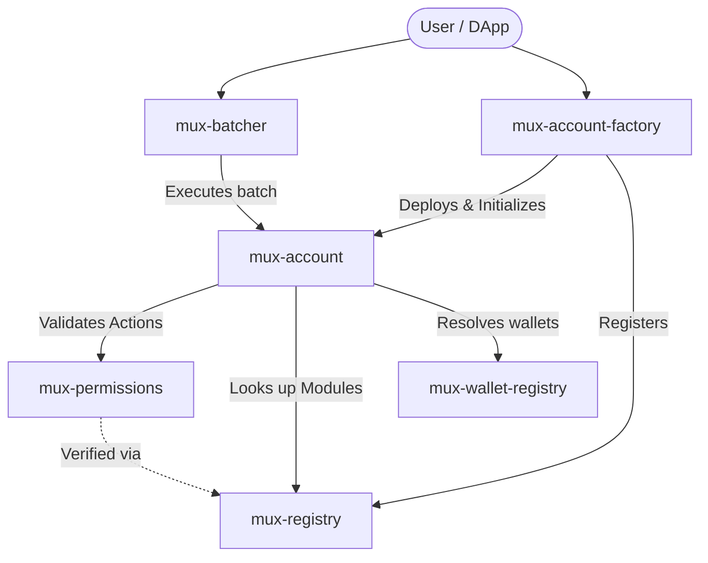

# Architecture Overview

This document provides a high-level overview of the Mux Protocol architecture. The system is composed of several interoperating smart contracts on the Soroban network that together enable a flexible account abstraction layer.

## Contract Architecture

The core contracts in the Mux Protocol workspace include:

- **mux-account**: The core smart account implementation, enabling abstracted logic and custom validation.
- **mux-account-factory**: Responsible for deterministic deployment and initialization of new Mux accounts.
- **mux-batcher**: A utility contract for batching multiple operations or contract calls into a single transaction.
- **mux-permissions**: A module for defining and enforcing role-based access control and granular permissions within Mux accounts.
- **mux-registry**: A central registry for discovering, verifying, and indexing components, accounts, and valid module implementations.
- **mux-wallet-registry**: A named address book that maps symbolic names to wallet addresses. Only a designated owner may write entries; reads are permissionless.

## Diagram

## System Flow

1. **Deployment**: Users interact with the `mux-account-factory` to deploy a new smart account deterministically.
2. **Execution**: Transactions can be sent individually or batched via the `mux-batcher` to optimize gas and latency.
3. **Validation**: The `mux-account` routes calls through `mux-permissions` to ensure the caller has the appropriate rights.
4. **Registry**: The `mux-registry` acts as the source of truth for protocol-wide configurations, valid plugin implementations, and discovery.

