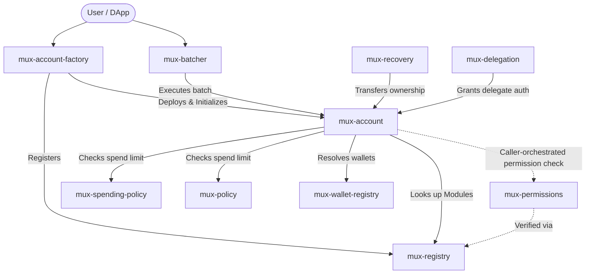

# Architecture Overview

> **Canonical.** This document and [`contracts/README.md`](../contracts/README.md) are
> the source of truth for the current contract workspace. `Somzilla.md` at the repo
> root is a non-canonical, unindexed scratch note — see the banner at the top of that
> file — and must not be used as an architecture reference.

This document provides a high-level overview of the Mux Protocol architecture. The system is composed of several interoperating smart contracts on the Soroban network that together enable a flexible account abstraction layer.

## Contract Architecture

The core contracts in the Mux Protocol workspace include:

- **mux-account**: The core smart account implementation, enabling abstracted logic and custom validation.
- **mux-account-factory**: Responsible for deterministic deployment and initialization of new Mux accounts.
- **mux-batcher**: A utility contract for batching multiple operations or contract calls into a single transaction.
- **mux-permissions**: A module for defining and enforcing role-based access control and granular permissions within Mux accounts.
- **mux-registry**: A central registry for discovering, verifying, and indexing components, accounts, and valid module implementations.
- **mux-wallet-registry**: A named address book that maps symbolic names to wallet addresses. Only a designated owner may write entries; reads are permissionless.
- **mux-recovery**: Social recovery contract for `mux-account` owners. Pre-registered guardians can transfer ownership to a new address after a mandatory timelock delay.
- **mux-delegation**: Delegation contract enabling owners to grant time-bounded or permission-scoped signing authority to delegate keys.
- **mux-policy**: Per-wallet daily spend-limit policy with auto-reset, enforced independently of `mux-account`'s own spend limits.
- **mux-spending-policy**: Per-account/per-asset spend-limit policy and validation, referenced by accounts that opt into externalized policy checks.

## Diagram

```mermaid
graph TD
    User([User / DApp]) --> Batcher[mux-batcher]
    User --> Factory[mux-account-factory]

    Factory -->|Deploys & Initializes| Account[mux-account]

    Batcher -->|Executes batch| Account

    Account -.->|Caller-orchestrated permission check| Permissions[mux-permissions]

    Account -->|Looks up Modules| Registry[mux-registry]
    Factory -->|Registers| Registry
    Permissions -.->|Verified via| Registry
    Account -->|Resolves wallets| WalletRegistry[mux-wallet-registry]

    Recovery[mux-recovery] -->|Transfers ownership| Account
    Delegation[mux-delegation] -->|Grants delegate auth| Account

    Account -->|Checks spend limit| Policy[mux-policy]
    Account -->|Checks spend limit| SpendingPolicy[mux-spending-policy]
```

## System Flow

1. **Deployment**: Users interact with the `mux-account-factory` to deploy a new smart account deterministically.
2. **Execution**: Transactions can be sent individually or batched via the `mux-batcher` to optimize gas and latency.
3. **Validation**: `mux-account` and `mux-permissions` are independent contracts that share no storage and do not call each other on-chain (see [`docs/audit-prep.md`](audit-prep.md)). Callers wishing to gate an action on a role or permission query `mux-permissions.has_permission` themselves — directly, or as one of the calls in a `mux-batcher` batch — before invoking `mux-account`.
4. **Registry**: The `mux-registry` acts as the source of truth for protocol-wide configurations, valid plugin implementations, and discovery.
5. **Recovery**: `mux-recovery` enables guardian-initiated ownership transfer with a timelock cancellation window. The contract can be linked to a `mux-registry` entry for auditability (see [`docs/recovery-trust-model.md`](recovery-trust-model.md)).
6. **Delegation**: `mux-delegation` allows account owners to grant scoped permissions to delegate addresses, enabling fine-grained access control without transferring ownership.
7. **Spend policy**: `mux-policy` and `mux-spending-policy` provide externalized, per-wallet and per-asset spend-limit enforcement that accounts can opt into in addition to the built-in `set_spend_limit` on `mux-account` (see [`docs/policy-semantics.md`](policy-semantics.md) and [`docs/spending-policy-semantics.md`](spending-policy-semantics.md)).

