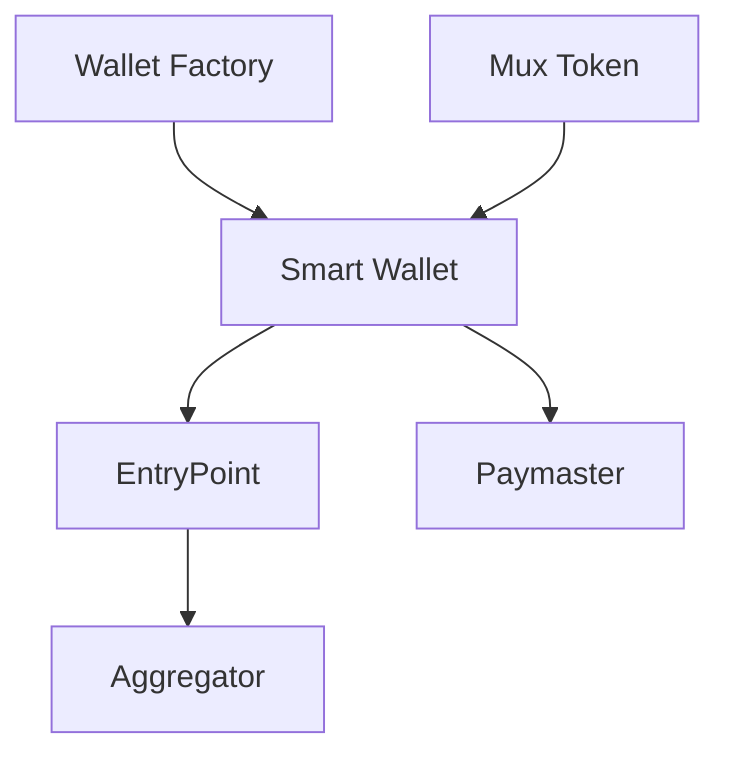

# Contract Dependency Graph

This document illustrates the dependencies between various contracts within the Mux Protocol.

## Description
- **Smart Wallet**: The core account contract for users.
- **EntryPoint**: The global entry point for ERC-4337 transactions.
- **Paymaster**: Handles gas sponsorship and custom fee logic.
- **Wallet Factory**: Deploys new Smart Wallet instances.
- **Mux Token**: The native protocol token.
- **Aggregator**: Signature aggregator for optimizing batched calls.
