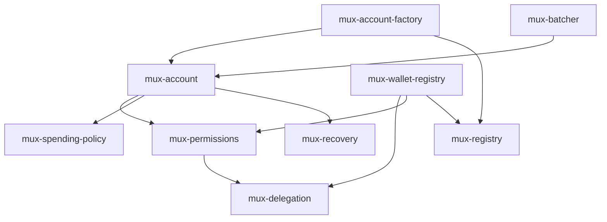

# Mux Contract Dependency Graph

This document is the authoritative map of **runtime contract-call relationships** in the Mux Protocol. It is separate from the Rust package graph: every contract crate currently depends directly on `soroban-sdk`, while the relationships below describe which contract addresses may be invoked at runtime.

## Graph

```mermaid
flowchart TD
  F[mux-account-factory] --> A[mux-account]
  A --> P[mux-permissions]
  A --> SP[mux-spending-policy]
  A --> R[mux-recovery]
  P --> D[mux-delegation]
  W[mux-wallet-registry] --> D
  W --> P
  F --> G[mux-registry]
  W --> G
  B[mux-batcher] --> A
```

## Relationship contract

| Caller | Callee | Purpose | Authorization invariant |
|---|---|---|---|
| `mux-account-factory` | `mux-account` | Create and register per-owner smart accounts | Factory creation is owner/registry authorized; clients cannot substitute an arbitrary account address. |
| `mux-account-factory` | `mux-registry` | Record account ownership and lookup metadata | Registry writes are authorized and idempotent. |
| `mux-account` | `mux-permissions` | Evaluate role and permission grants | A missing, expired, or revoked grant denies the action. |
| `mux-account` | `mux-spending-policy` | Enforce spend limits and allow/deny policy | Policy is checked on-chain before a spend is dispatched. |
| `mux-account` | `mux-recovery` | Delegate guardian recovery workflow | Recovery remains time-locked and replay-safe. |
| `mux-permissions` | `mux-delegation` | Resolve scoped delegate state | Revoked delegates are denied immediately. |
| `mux-wallet-registry` | `mux-delegation` | Bind wallet-level delegates | Registry metadata never grants authority by itself. |
| `mux-wallet-registry` | `mux-permissions` | Associate wallet roles and policy entries | Role changes are authenticated and fail closed. |
| `mux-wallet-registry` | `mux-registry` | Publish wallet/account discovery metadata | Registry is a lookup layer, not an authorization source. |
| `mux-batcher` | `mux-account` | Dispatch bounded authorized operations | Every operation is independently authorized; batching adds no authority. |

`mux-policy` is the standalone daily-spend policy contract used by deployments that keep policy state separate from `mux-account`; it must be treated as a policy dependency when configured. `mux-registry` and `mux-wallet-registry` are lookup layers and must never be trusted as the sole authorization decision.

## Source and deployment invariants

The graph is derived from the entrypoint behavior under `contracts/`, `docs/architecture-overview.md`, and the deployment inventory in `config/addresses.json`. A change to a cross-contract call must update this document in the same PR. The CI check `scripts/check-dependency-graph.sh` verifies that every workspace contract is named and that every edge references a known contract.

Runtime writes fail closed when an RPC or dependency call is unavailable. No graph edge authorizes a caller on its own; the callee re-checks owner, delegate, guardian, or policy authorization. See [`threat-model.md`](threat-model.md), [`architecture-overview.md`](architecture-overview.md), and [`authorize-flow-example.md`](authorize-flow-example.md).
